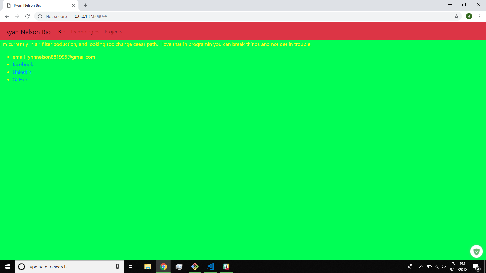
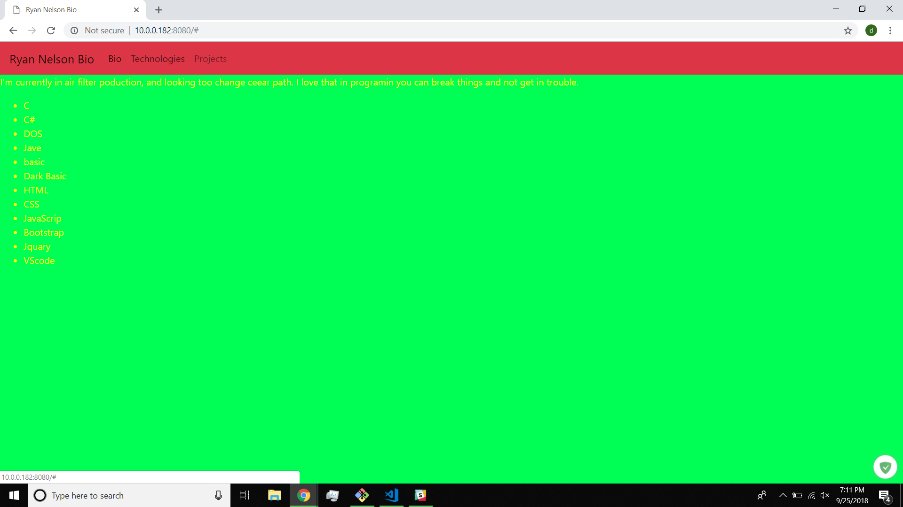

# Personal Bio Site

This project is a website for my Personal bio Site

## Screenshots




## How to Run this Project
* Use npm to install http-server in your terminal:
```sh
npm install -g http-server
```
* Run the server
```sh
hs -p 9999
```
* Open chrome and navigate to:
```
localhost:9999
```
If this doesn't work, contact your doctor immediately.  
